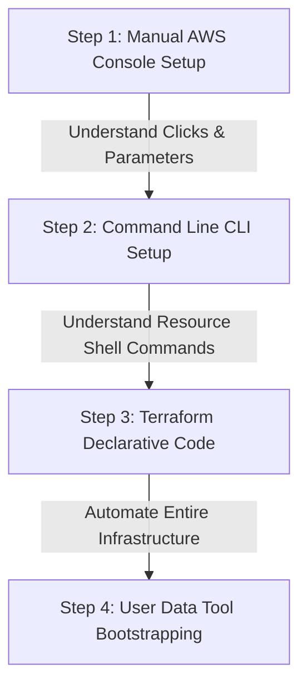

# Workbook: AWS Homelab Learning & Transition Journey

This detailed workbook outlines the step-by-step process of building your AWS Red Team vs. Blue Team Homelab, moving systematically from **Manual Setup (AWS Console/CLI)** to **Infrastructure as Code (Terraform Automation)**.

---

## The Transition Strategy: Why Manual First?



By performing the setup manually first, you learn the exact relationships between AWS components (e.g., how a Route Table associates with a Subnet). Once you understand the dependencies, you can codify them into Terraform.

---

## What You Are Building and How You Will Access It

**Terraform runs on your Ubuntu machine** and deploys the entire lab infrastructure with a single command. It replaces all the AWS Console clicking — no manually launching instances, no configuring security groups through a browser. You run `terraform apply` once and it creates the VPC, subnets, security groups, and all three EC2 instances automatically.

The only two things that still require a browser:
- **IAM user setup** — one-time, creates the credentials Terraform uses to talk to AWS
- **Kali AMI ID lookup** — one-time, find the AMI ID in AWS Marketplace and paste it into your config file

Everything else is copy-paste terminal commands from your Ubuntu machine.

---

**Once the instances are running, you access each one differently:**

| Instance | How You Access It | What You See |
|----------|-------------------|--------------|
| **Kali Linux** | SSH terminal — `ssh -i ~/.ssh/redblue-lab-keypair.pem kali@<ip>` | Command line terminal |
| **Windows Server** | RDP via `xfreerdp` — opens a window on your desktop | Full Windows GUI desktop |
| **Splunk** | Browser — `http://<siem-ip>:8000` | Splunk web dashboard |
| **Nessus** | Browser — `https://<siem-ip>:8834` | Nessus web dashboard |

**None of these require going back to the AWS Console.** The AWS Console becomes read-only after initial setup — you can log in to see your instances listed, but Terraform built them and Terraform tears them down.

---

## Prerequisites — Ubuntu Workstation Setup

Complete these once before any phase. All commands run on your local Ubuntu machine.

### Install AWS CLI v2

```bash
curl "https://awscli.amazonaws.com/awscli-exe-linux-x86_64.zip" -o /tmp/awscliv2.zip
unzip /tmp/awscliv2.zip -d /tmp/
sudo /tmp/aws/install
aws --version
# Expected: aws-cli/2.x.x
```

### Install Terraform

```bash
sudo apt-get update && sudo apt-get install -y gnupg software-properties-common
wget -O- https://apt.releases.hashicorp.com/gpg | \
  gpg --dearmor | \
  sudo tee /usr/share/keyrings/hashicorp-archive-keyring.gpg > /dev/null
echo "deb [signed-by=/usr/share/keyrings/hashicorp-archive-keyring.gpg] \
  https://apt.releases.hashicorp.com $(lsb_release -cs) main" | \
  sudo tee /etc/apt/sources.list.d/hashicorp.list
sudo apt-get update && sudo apt-get install -y terraform
terraform --version
# Expected: Terraform v1.5.x or higher
```

### Create IAM User (AWS Console)

1. Go to **IAM** → **Users** → **Create User** → Name: `aws-redblue-lab-user`
2. **Attach policies directly** — check all six:
   - `AmazonEC2FullAccess`
   - `AmazonVPCFullAccess`
   - `AmazonS3FullAccess`
   - `IAMFullAccess`
   - `AWSCloudTrail_FullAccess`
   - `CloudWatchLogsFullAccess`
3. Click the user → **Security credentials** → **Create access key** → **Command Line Interface (CLI)**
4. Save the Access Key ID and Secret Access Key

### Configure AWS CLI

```bash
aws configure
# AWS Access Key ID:     <paste your key>
# AWS Secret Access Key: <paste your secret>
# Default region:        us-east-2
# Default output format: json

# Verify it works
aws sts get-caller-identity
# Expected: JSON with your Account ID and UserId
```

### Create SSH Key Pair in AWS

```bash
aws ec2 create-key-pair \
  --key-name redblue-lab-keypair \
  --region us-east-2 \
  --query 'KeyMaterial' \
  --output text > ~/.ssh/redblue-lab-keypair.pem

chmod 400 ~/.ssh/redblue-lab-keypair.pem
ls -la ~/.ssh/redblue-lab-keypair.pem
# Expected: -r-------- ... redblue-lab-keypair.pem
```

---

## Phase 1: The Manual Learning Journey

### Lab 1.1: IAM Programmatic Credentials
1.  **Objective:** Create an API user so your local Ubuntu machine can control AWS from the terminal.
2.  **AWS Console Clicks:**
    *   Navigate to **IAM** → **Users** → **Create User** → Name: `aws-redblue-lab-user`
    *   **Attach policies directly** — check all six: `AmazonEC2FullAccess`, `AmazonVPCFullAccess`, `AmazonS3FullAccess`, `IAMFullAccess`, `AWSCloudTrail_FullAccess`, `CloudWatchLogsFullAccess`
    *   Click the user → **Security credentials** → **Create access key** → **Command Line Interface (CLI)**
    *   Download or copy the Access Key ID and Secret Access Key
3.  **Local Binding (your Ubuntu machine):**
    ```bash
    aws configure
    # AWS Access Key ID:     <paste>
    # AWS Secret Access Key: <paste>
    # Default region:        us-east-2
    # Default output format: json
    ```
4.  **Verification:**
    ```bash
    aws sts get-caller-identity
    # Expected: JSON with your Account ID — means credentials work
    ```

---

### Lab 1.2: Networking Foundation (VPC & Routing)
1.  **Objective:** Set up an isolated subnet and routing table to allow resources to access the internet securely.
2.  **Step-by-Step Manual Operations:**
    *   **Create VPC:**
        *   Navigate to **VPC** -> **Your VPCs** -> **Create VPC**.
        *   Choose **VPC only**, Name: `RedBlue-Lab-VPC`, CIDR: `10.0.0.0/16`.
    *   **Create Subnet:**
        *   **Subnets** -> **Create Subnet** -> Select `RedBlue-Lab-VPC`.
        *   Name: `RedBlue-Public-Subnet`, CIDR: `10.0.1.0/24`, AZ: `us-east-2a`.
    *   **Create & Attach Internet Gateway (IGW):**
        *   **Internet Gateways** -> **Create Internet Gateway**. Name: `RedBlue-IGW`.
        *   Select `RedBlue-IGW` -> **Actions** -> **Attach to VPC** -> Select `RedBlue-Lab-VPC`.
    *   **Configure Route Table:**
        *   **Route Tables** -> Find the main route table for your VPC.
        *   Click **Routes** -> **Edit routes** -> **Add route**.
        *   Destination: `0.0.0.0/0` (all traffic) -> Target: **Internet Gateway** -> Select `RedBlue-IGW`.
        *   Click **Subnet associations** -> **Edit subnet associations** -> Check `RedBlue-Public-Subnet` -> Save.

---

### Lab 1.3: System Deployment & Access
1.  **Objective:** Launch the systems and retrieve credentials.
2.  **Launch Configuration:**
    *   **Kali Linux:** Search the AWS Marketplace for `Kali Linux`. Launch instance type `t3.medium`, 20GB gp3 storage, and assign the security group allowing SSH (Port 22) and RDP (Port 3389).
    *   **Windows Server 2022:** Search for `Windows Server 2022 Base`. Launch type `t3.small`, 30GB gp3 storage, and assign security group allowing RDP (Port 3389).
    *   **Ubuntu monitoring box:** Launch standard `Ubuntu Server 22.04 LTS`. Launch type `t3.large` (necessary to run both Splunk and Nessus), 50GB gp3 storage, and assign security group allowing Splunk Web (8000), Splunk receiver (9997), and Nessus (8834).
3.  **Credential Retrieval (Windows):**
    *   Decrypt the Windows administrator password using your private key:
        ```bash
        aws ec2 get-password-data --instance-id <windows-instance-id> --priv-launch-key ~/.ssh/redblue-lab-keypair.pem
        ```

---

## Phase 2: The Defensive & Tool Configuration

### Lab 2.1: SIEM Pipeline (Splunk & Universal Forwarder)
1.  **On Ubuntu Monitoring Server:**
    *   Download and install Splunk:
        ```bash
        cd /tmp
        wget -O splunk.deb 'https://download.splunk.com/products/splunk/releases/9.1.2/linux/splunk-9.1.2-b6b9c8185839-linux-2.6-amd64.deb'
        sudo dpkg -i splunk.deb
        sudo /opt/splunk/bin/splunk start --accept-license
        ```
    *   Access Splunk Web on port `8000`. Navigate to **Settings** -> **Forwarding and Receiving** -> **Configure receiving** -> **New Receiving Port** -> Enter `9997` -> Save.
    *   Go to **Settings** -> **Indexes** -> **New Index** -> Name: `win-security` -> Save.
2.  **On Windows Target:**
    *   Download the **Splunk Universal Forwarder** MSI.
    *   During installation, enter the private IP of the Ubuntu monitoring instance (`10.0.1.30`) and port `9997` as the receiving indexer.
    *   Create `inputs.conf` in `C:\Program Files\SplunkUniversalForwarder\etc\system\local\inputs.conf` and populate it to grab Security, Application, and System logs.
    *   Restart the forwarder service via Command Prompt:
        ```cmd
        net stop SplunkForwarder && net start SplunkForwarder
        ```
    *   *Verification:* In Splunk Search bar, run `index=win-security` and check if Windows event logs appear.

---

## Phase 3: Transitioning to Automation (Terraform)

Now that you have built the environment manually, you can automate it using Terraform. This demonstrates high-level engineering skills.

### 1. Terraform Project Structure
Initialize your project folder using these files inside the `terraform/` directory:

```text
terraform/
├── providers.tf              <-- AWS Provider declaration
├── variables.tf              <-- All configurable inputs (region, AMIs, passwords, versions)
├── main.tf                   <-- All resources: VPC, SGs, EC2s, Flow Logs, CloudTrail
├── outputs.tf                <-- Prints public IPs after deploy
└── terraform.tfvars.example  <-- Copy → terraform.tfvars and fill in before deploy
```

### 2. File Blueprints

#### File: `providers.tf`
```hcl
terraform {
  required_providers {
    aws = {
      source  = "hashicorp/aws"
      version = "~> 5.0"
    }
  }
}

provider "aws" {
  region = var.aws_region
}
```

#### File: `variables.tf`
```hcl
variable "aws_region" {
  description = "AWS region to deploy resources"
  type        = string
  default     = "us-east-2"
}

variable "key_name" {
  description = "Name of the SSH key pair"
  type        = string
  default     = "redblue-lab-keypair"
}

variable "admin_ip" {
  description = "Your public IP CIDR to restrict access (e.g., 203.0.113.50/32)"
  type        = string
}

variable "splunk_password" {
  description = "Admin password for Splunk Web UI (min 8 chars, mixed case + digit)"
  type        = string
  sensitive   = true
}

variable "splunk_version" {
  description = "Splunk Enterprise version — find latest at splunk.com/en_us/download/splunk-enterprise.html"
  type        = string
  default     = "9.1.2"
}

variable "splunk_build" {
  description = "Splunk build hash — must match splunk_version (visible in the download URL)"
  type        = string
  default     = "b6b9c8185839"
}

variable "nessus_deb_url" {
  description = "Nessus .deb download URL — get current URL from tenable.com/downloads/nessus"
  type        = string
  default     = "https://www.tenable.com/downloads/api/v1/public/pages/nessus/downloads/24057/Nessus-10.6.3-debian10_amd64.deb"
}

variable "ami_kali" {
  description = "Kali Linux AMI ID for your region — find in AWS Marketplace"
  type        = string
}

variable "ami_windows" {
  description = "Windows Server 2022 Base AMI ID for your region"
  type        = string
}

variable "ami_ubuntu" {
  description = "Ubuntu 22.04 LTS AMI ID — aws ec2 describe-images --owners 099720109477 ..."
  type        = string
}
```

#### File: `main.tf`
```hcl
data "aws_caller_identity" "current" {}

# 1. VPC
resource "aws_vpc" "lab_vpc" {
  cidr_block           = "10.0.0.0/16"
  enable_dns_hostnames = true
  enable_dns_support   = true
  tags = { Name = "RedBlue-Lab-VPC" }
}

# 2. Internet Gateway
resource "aws_internet_gateway" "lab_igw" {
  vpc_id = aws_vpc.lab_vpc.id
  tags   = { Name = "RedBlue-IGW" }
}

# 3. Subnet
resource "aws_subnet" "public_subnet" {
  vpc_id                  = aws_vpc.lab_vpc.id
  cidr_block              = "10.0.1.0/24"
  availability_zone       = "${var.aws_region}a"
  map_public_ip_on_launch = true
  tags = { Name = "RedBlue-Public-Subnet" }
}

# 4. Route Table
resource "aws_route_table" "public_rt" {
  vpc_id = aws_vpc.lab_vpc.id
  route {
    cidr_block = "0.0.0.0/0"
    gateway_id = aws_internet_gateway.lab_igw.id
  }
  tags = { Name = "RedBlue-Public-RouteTable" }
}

resource "aws_route_table_association" "public_assoc" {
  subnet_id      = aws_subnet.public_subnet.id
  route_table_id = aws_route_table.public_rt.id
}

# 5. Security Group — Kali + Windows
resource "aws_security_group" "main_sg" {
  name        = "RedBlue-Main-SG"
  description = "Management access and full internal subnet communication"
  vpc_id      = aws_vpc.lab_vpc.id

  ingress {
    description = "SSH from admin"
    from_port   = 22
    to_port     = 22
    protocol    = "tcp"
    cidr_blocks = [var.admin_ip]
  }
  ingress {
    description = "RDP from admin"
    from_port   = 3389
    to_port     = 3389
    protocol    = "tcp"
    cidr_blocks = [var.admin_ip]
  }
  ingress {
    description = "All internal subnet traffic"
    from_port   = 0
    to_port     = 0
    protocol    = "-1"
    cidr_blocks = ["10.0.1.0/24"]
  }
  egress {
    from_port   = 0
    to_port     = 0
    protocol    = "-1"
    cidr_blocks = ["0.0.0.0/0"]
  }
}

# 6. Security Group — Ubuntu SIEM
resource "aws_security_group" "tools_sg" {
  name        = "RedBlue-SecurityTools-SG"
  description = "Splunk, Nessus, and internal forwarder traffic"
  vpc_id      = aws_vpc.lab_vpc.id

  ingress {
    description = "SSH from admin"
    from_port   = 22
    to_port     = 22
    protocol    = "tcp"
    cidr_blocks = [var.admin_ip]
  }
  ingress {
    description = "Splunk Web UI"
    from_port   = 8000
    to_port     = 8000
    protocol    = "tcp"
    cidr_blocks = [var.admin_ip]
  }
  ingress {
    description = "Nessus Web UI"
    from_port   = 8834
    to_port     = 8834
    protocol    = "tcp"
    cidr_blocks = [var.admin_ip]
  }
  ingress {
    description = "Splunk Universal Forwarder receiver"
    from_port   = 9997
    to_port     = 9997
    protocol    = "tcp"
    cidr_blocks = ["10.0.1.0/24"]
  }
  egress {
    from_port   = 0
    to_port     = 0
    protocol    = "-1"
    cidr_blocks = ["0.0.0.0/0"]
  }
}

# 7. EC2 Instances — private IPs pinned to match documentation
resource "aws_instance" "kali" {
  ami                    = var.ami_kali
  instance_type          = "t3.medium"
  subnet_id              = aws_subnet.public_subnet.id
  key_name               = var.key_name
  private_ip             = "10.0.1.10"
  vpc_security_group_ids = [aws_security_group.main_sg.id]

  root_block_device {
    volume_size = 20
    volume_type = "gp3"
  }
  tags = { Name = "Kali-Attacker", Role = "RedTeam" }
}

resource "aws_instance" "windows" {
  ami                    = var.ami_windows
  instance_type          = "t3.small"
  subnet_id              = aws_subnet.public_subnet.id
  key_name               = var.key_name
  private_ip             = "10.0.1.20"
  vpc_security_group_ids = [aws_security_group.main_sg.id]

  root_block_device {
    volume_size = 30
    volume_type = "gp3"
  }
  tags = { Name = "Windows-Target", Role = "Victim" }
}

resource "aws_instance" "ubuntu_siem" {
  ami                    = var.ami_ubuntu
  instance_type          = "t3.large"
  subnet_id              = aws_subnet.public_subnet.id
  key_name               = var.key_name
  private_ip             = "10.0.1.30"
  vpc_security_group_ids = [aws_security_group.tools_sg.id]

  user_data = templatefile("${path.module}/../scripts/install_tools.sh", {
    splunk_password = var.splunk_password
    splunk_version  = var.splunk_version
    splunk_build    = var.splunk_build
    nessus_deb_url  = var.nessus_deb_url
  })

  root_block_device {
    volume_size = 50
    volume_type = "gp3"
  }
  tags = { Name = "Security-Tools-SIEM", Role = "BlueTeam" }
}

# 8. VPC Flow Logs → CloudWatch (all traffic, 14-day retention)
resource "aws_cloudwatch_log_group" "flow_logs" {
  name              = "/redblue-lab/vpc-flow-logs"
  retention_in_days = 14
}

resource "aws_iam_role" "flow_logs" {
  name = "RedBlue-VPCFlowLogs-Role"
  assume_role_policy = jsonencode({
    Version = "2012-10-17"
    Statement = [{
      Action    = "sts:AssumeRole"
      Effect    = "Allow"
      Principal = { Service = "vpc-flow-logs.amazonaws.com" }
    }]
  })
}

resource "aws_iam_role_policy" "flow_logs" {
  name = "RedBlue-VPCFlowLogs-Policy"
  role = aws_iam_role.flow_logs.id
  policy = jsonencode({
    Version = "2012-10-17"
    Statement = [{
      Effect   = "Allow"
      Action   = ["logs:CreateLogGroup", "logs:CreateLogStream", "logs:PutLogEvents",
                  "logs:DescribeLogGroups", "logs:DescribeLogStreams"]
      Resource = "*"
    }]
  })
}

resource "aws_flow_log" "lab" {
  iam_role_arn    = aws_iam_role.flow_logs.arn
  log_destination = aws_cloudwatch_log_group.flow_logs.arn
  traffic_type    = "ALL"
  vpc_id          = aws_vpc.lab_vpc.id
}

# 9. CloudTrail → S3
resource "aws_s3_bucket" "trail" {
  bucket        = "redblue-lab-trail-${data.aws_caller_identity.current.account_id}"
  force_destroy = true
}

resource "aws_s3_bucket_policy" "trail" {
  bucket = aws_s3_bucket.trail.id
  policy = jsonencode({
    Version = "2012-10-17"
    Statement = [
      {
        Sid       = "AWSCloudTrailAclCheck"
        Effect    = "Allow"
        Principal = { Service = "cloudtrail.amazonaws.com" }
        Action    = "s3:GetBucketAcl"
        Resource  = aws_s3_bucket.trail.arn
      },
      {
        Sid       = "AWSCloudTrailWrite"
        Effect    = "Allow"
        Principal = { Service = "cloudtrail.amazonaws.com" }
        Action    = "s3:PutObject"
        Resource  = "${aws_s3_bucket.trail.arn}/AWSLogs/${data.aws_caller_identity.current.account_id}/*"
        Condition = { StringEquals = { "s3:x-amz-acl" = "bucket-owner-full-control" } }
      }
    ]
  })
}

resource "aws_cloudtrail" "lab" {
  name                          = "redblue-lab-trail"
  s3_bucket_name                = aws_s3_bucket.trail.id
  include_global_service_events = true
  is_multi_region_trail         = false
  enable_logging                = true
  depends_on                    = [aws_s3_bucket_policy.trail]
}
```

#### File: `outputs.tf`
```hcl
output "kali_public_ip" {
  value       = aws_instance.kali.public_ip
  description = "Public IP of the Kali Attacker Box"
}

output "windows_public_ip" {
  value       = aws_instance.windows.public_ip
  description = "Public IP of the Windows Target Server"
}

output "ubuntu_siem_public_ip" {
  value       = aws_instance.ubuntu_siem.public_ip
  description = "Public IP of the Ubuntu Security Box"
}
```

---

## Phase 4: Automated Tool Bootstrapping

To automate the software installation inside the instances (so you don't have to SSH and manual install tools), write user-data shell scripts.

### File: `scripts/install_tools.sh`

The script uses `templatefile()` syntax — `${variable}` placeholders are filled in by Terraform at deploy time. Never hardcode passwords or version strings directly in this file.

```bash
#!/bin/bash
set -euo pipefail

# Versions injected by Terraform templatefile — update in terraform.tfvars, not here.
SPLUNK_VERSION="${splunk_version}"
SPLUNK_BUILD="${splunk_build}"
NESSUS_DEB_URL="${nessus_deb_url}"

apt-get update -y
apt-get upgrade -y
apt-get install -y net-tools tcpdump wget curl unzip

# Splunk Enterprise
cd /tmp
wget -O splunk.deb "https://download.splunk.com/products/splunk/releases/$SPLUNK_VERSION/linux/splunk-$SPLUNK_VERSION-$SPLUNK_BUILD-linux-2.6-amd64.deb"
dpkg -i splunk.deb
apt-get install -f -y
/opt/splunk/bin/splunk start --accept-license --answer-yes --no-prompt --seed-passwd "${splunk_password}"
/opt/splunk/bin/splunk enable boot-start -systemd-managed 1 --accept-license --answer-yes --no-prompt

# Tenable Nessus (Nessus Essentials is free for up to 16 IPs — activate on first login)
wget -O nessus.deb "$NESSUS_DEB_URL"
dpkg -i nessus.deb
apt-get install -f -y
systemctl start nessusd.service
systemctl enable nessusd.service
```

---

## Phase 5: Full Deployment — Ubuntu Step by Step

### Step 1 — Gather AMI IDs for us-east-2

Run all three commands from your Ubuntu terminal. Save the output — you will need it in Step 2.

```bash
# Ubuntu 22.04 LTS (Canonical)
aws ec2 describe-images \
  --owners 099720109477 \
  --filters 'Name=name,Values=ubuntu/images/hvm-ssd/ubuntu-jammy-22.04-amd64-server-*' \
            'Name=state,Values=available' \
  --query 'sort_by(Images,&CreationDate)[-1].ImageId' \
  --output text \
  --region us-east-2
```

```bash
# Windows Server 2022 (Amazon)
aws ec2 describe-images \
  --owners amazon \
  --filters 'Name=name,Values=Windows_Server-2022-English-Full-Base-*' \
            'Name=state,Values=available' \
  --query 'sort_by(Images,&CreationDate)[-1].ImageId' \
  --output text \
  --region us-east-2
```

```bash
# Kali Linux — AWS Marketplace (browser, one-time lookup):
# 1. Go to https://aws.amazon.com/marketplace and search "Kali Linux"
# 2. Click the Offensive Security listing → "Continue to Subscribe" → "Continue to Configuration"
# 3. Set Region to us-east-2 — the AMI ID is shown on that page (ami-xxxxxxxxxxxxxxxxx)
# 4. Copy that ID into terraform.tfvars as ami_kali — do NOT click "Launch"
```

```bash
# Your current public IP (for admin_ip variable)
curl -s https://checkip.amazonaws.com
# Append /32 to the output, e.g. 203.0.113.50 → 203.0.113.50/32
```

---

### Step 2 — Fill in terraform.tfvars

```bash
cd /path/to/AWS_RedBlue_Homelab/terraform
cp terraform.tfvars.example terraform.tfvars
nano terraform.tfvars
```

Fill in every field. Example with real values:

```hcl
admin_ip        = "203.0.113.50/32"       # your IP from Step 1
splunk_password = "Redblue!Lab2026"        # min 8 chars, mixed case + digit
ami_kali        = "ami-0xxxxxxxxxxxxxxxx"  # from Step 1
ami_windows     = "ami-0xxxxxxxxxxxxxxxx"  # from Step 1
ami_ubuntu      = "ami-0xxxxxxxxxxxxxxxx"  # from Step 1
```

Save and close. Verify the file is populated:

```bash
grep -v "^#" terraform.tfvars | grep -v "^$"
```

---

### Step 3 — Initialize and Validate

```bash
terraform init
```
Expected: `Terraform has been successfully initialized!`

```bash
terraform validate
```
Expected: `Success! The configuration is valid.`

---

### Step 4 — Deploy

```bash
terraform apply
```

Review the plan Terraform prints — it should show ~16 resources to create. Type `yes` and press Enter.

Deployment takes 3–5 minutes. When finished, Terraform prints the three public IPs:

```
Outputs:
kali_public_ip        = "x.x.x.x"
ubuntu_siem_public_ip = "x.x.x.x"
windows_public_ip     = "x.x.x.x"
```

Save these IPs. Re-display them any time with:

```bash
terraform output
```

---

### Step 5 — Verify SIEM Bootstrap

The Ubuntu SIEM runs `install_tools.sh` in the background on first boot. It takes 8–12 minutes to install Splunk and Nessus. Monitor it live:

```bash
ssh -i ~/.ssh/redblue-lab-keypair.pem ubuntu@<SIEM_PUBLIC_IP> \
  'sudo tail -f /var/log/cloud-init-output.log'
```

Wait until you see:
```
nessusd.service enabled
```
Then press `Ctrl+C` to exit.

Confirm Splunk is running:

```bash
ssh -i ~/.ssh/redblue-lab-keypair.pem ubuntu@<SIEM_PUBLIC_IP> \
  'sudo /opt/splunk/bin/splunk status'
# Expected: splunkd is running (PID: xxxxx)
```

---

### Step 6 — Access Web UIs

Open in your browser:

| Service | URL | Credentials |
|---------|-----|-------------|
| Splunk Web | `http://<SIEM_PUBLIC_IP>:8000` | `admin` / your `splunk_password` |
| Nessus | `https://<SIEM_PUBLIC_IP>:8834` | Set on first login |

**Nessus first-login setup:**
1. Navigate to `https://<SIEM_PUBLIC_IP>:8834` (accept the self-signed cert warning)
2. Choose **Nessus Essentials** (free, up to 16 IPs)
3. Register for a free activation code at tenable.com if you don't have one
4. Enter the activation code and create your admin account

---

### Step 7 — Connect to Kali

```bash
ssh -i ~/.ssh/redblue-lab-keypair.pem kali@<KALI_PUBLIC_IP>
```

Verify Kali tools are available:

```bash
nmap --version
msfconsole --version
hydra --version
```

---

### Step 8 — Connect to Windows (RDP from Ubuntu)

**Get the Windows administrator password:**

```bash
# Get the Windows instance ID
WINDOWS_ID=$(aws ec2 describe-instances \
  --filters 'Name=tag:Name,Values=Windows-Target' \
  --query 'Reservations[0].Instances[0].InstanceId' \
  --output text \
  --region us-east-2)
echo "Instance ID: $WINDOWS_ID"

# Retrieve and decrypt the password (wait 2-3 min after deploy for it to be available)
aws ec2 get-password-data \
  --instance-id "$WINDOWS_ID" \
  --priv-launch-key ~/.ssh/redblue-lab-keypair.pem \
  --region us-east-2 \
  --query 'PasswordData' \
  --output text
```

**RDP from Ubuntu using xfreerdp:**

```bash
sudo apt-get install -y freerdp2-x11

xfreerdp /v:<WINDOWS_PUBLIC_IP> \
          /u:Administrator \
          /p:'<PASSWORD_FROM_ABOVE>' \
          /w:1920 /h:1080 \
          /cert:ignore
```

---

### Step 9 — Configure Windows Splunk Forwarder

Do this inside the RDP session on the Windows target.

1. Open a browser on Windows and download **Splunk Universal Forwarder** from `splunk.com/en_us/download/universal-forwarder.html` (choose the 64-bit Windows MSI)

2. Run the installer. When prompted for a **Receiving Indexer**, enter:
   - Host: `10.0.1.30`
   - Port: `9997`

3. Open Notepad as Administrator and create the inputs config file:
   - Path: `C:\Program Files\SplunkUniversalForwarder\etc\system\local\inputs.conf`
   - Content (copy from `scripts/splunk_inputs.conf` in this repo):
     ```ini
     [WinEventLog://Security]
     index = win-security
     disabled = 0

     [WinEventLog://Application]
     index = win-security
     disabled = 0

     [WinEventLog://System]
     index = win-security
     disabled = 0
     ```

4. Restart the forwarder service. Open **Command Prompt as Administrator**:
   ```cmd
   net stop SplunkForwarder && net start SplunkForwarder
   ```

5. Verify logs are flowing — back on your Ubuntu machine, check Splunk:
   - Go to `http://<SIEM_PUBLIC_IP>:8000`
   - Search bar: `index=win-security | head 10`
   - You should see Windows Event Log entries within 30 seconds

---

### Step 10 — Tear Down

**Stop instances (saves cost, preserves state):**

```bash
aws ec2 stop-instances \
  --instance-ids \
    $(aws ec2 describe-instances \
      --filters 'Name=tag:Name,Values=Kali-Attacker,Windows-Target,Security-Tools-SIEM' \
      --query 'Reservations[*].Instances[*].InstanceId' \
      --output text \
      --region us-east-2) \
  --region us-east-2
```

**Full destroy (removes everything, stops all charges):**

```bash
cd /path/to/AWS_RedBlue_Homelab/terraform
terraform destroy
# Type 'yes' when prompted
```

Expected output ends with: `Destroy complete! Resources: 16 destroyed.`

---

### Troubleshooting

| Problem | Check |
|---------|-------|
| `terraform apply` fails with "UnauthorizedOperation" | IAM user is missing a required policy — see Prerequisites section |
| SSH connection refused to Kali or SIEM | Instance still booting, wait 60s and retry. Verify your current IP matches `admin_ip` in tfvars: `curl -s https://checkip.amazonaws.com` |
| Splunk not reachable at `:8000` after 15 min | Bootstrap may have failed: `ssh ubuntu@<SIEM_IP> 'sudo grep -i error /var/log/cloud-init-output.log'` |
| Windows password returns empty | Instance needs 2–4 min after first boot to generate the password. Wait and retry. |
| `xfreerdp` certificate error | Add `/cert:ignore` flag to the command |
| `index=win-security` returns no results | Confirm the forwarder service is running on Windows: `sc query SplunkForwarder` |
